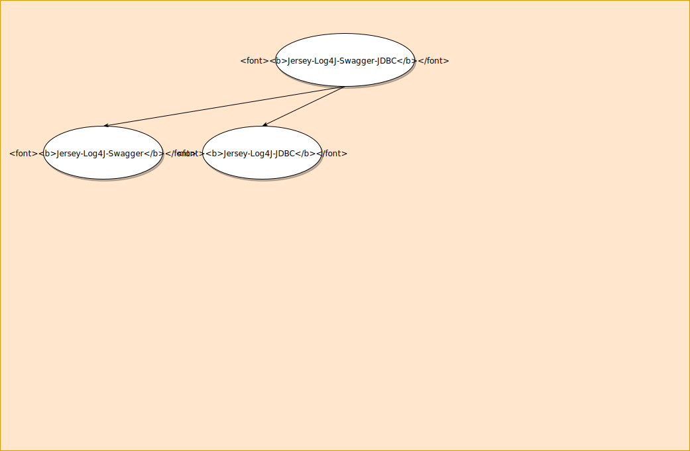

# Презентация для разработчиков *Jepria*

В основе *SoftSpiders* лежит база знаний, организованная в виде иерархии прототипов, которая снабжена удобными
средствами поиска, навигации и их создания.
Предполагается, что эта база должна охватывать все виды программной разработки без каких бы то ни было ограничений.

На проект *SoftSpiders* можно смотреть по-разному.

В основе проекта 
На него можно смотреть как на средство быстрого прототипирования, может выполнять образовательные функции, 
...

В дополнение к перечисленному проект предлагает некий способ сохранения и передачи важной части опыта, получаемого в
процессе освоения программных инструментов и разработки программ. 

...

## О проектах-стартерах

Есть такой вид программных проектов, своего рода жанр, которые называтся проекты-стартеры.
На GitHub их множество.
Они предназначены для использования другими разработчиками в качестве основы - отправных точек для их собственных
проектов ?

Показать примеры на GitHub

Каждый стартер характеризуется прежде всего набором поддерживаемых свойств, по которому разработчики определяют,
насколько им может подойти тот или другой стартер.

### Поиск стартера

Google, GitHub, ...

TBD

## Иерархия на основе тегов

В качестве основы дальнейшей автоматизации сценариев работы с нашей иерархией заложим некоторую математическую, а точнее -
дискретно-математическую базу.  

И, на всякий случай, сразу хочу предупредить, всё это очень просто и совсем не страшно.

Предположим, имеется некий словарь тегов {a, b, c}.
Постороим иерархию на основе всесозможных сочетаний этих тегов.

Отметим несколько фактов:
- в графе отсутствуют циклы (иначе бы мы не имели право называть его иерархией)
- основой иерархии является множество тегов - отношения принадлежности этих множеств
- иерархия является недревовидной и частично-упорядоченной

Фактически это
[*Диаграмма Хассе*](https://ru.wikipedia.org/wiki/%D0%94%D0%B8%D0%B0%D0%B3%D1%80%D0%B0%D0%BC%D0%BC%D0%B0_%D0%A5%D0%B0%D1%81%D1%81%D0%B5) - способ изображения частично-упорядоченных множеств

Графы такого вида являются ориентированными графами без циклов, их часто обозначают аббревиатурой *DAG* (*Directed
Acyclic Graph*). 

Такими множествами, которые в данном случае частично упорядочиваются являются множества тегов.

### Пример, более приближенный к жизни

 

Здесь не все узлы имеют практический смысл.

Иерархия, имеющая практический смысл:

Или, чуть более красиво:
 
 

## Реальный сценарий

Рассмотрим, как в реальности может происходить создание такой иерархии, как и для чего она может использоваться.

TBD

## Почему недостаточно тегов в GitHub ?

 

## Свойство (Feature)

### Тег - идентификатор свойства

TBD

## SS-иерархия

### Иерархия Java-интерфейсов

Для того, чтобы плавно войти в организацию SS-иерархии, хоть это и совсем просто, в аудитории Java-разработчиков нелишне
будет напомнить об организации иерархии Java-интерфейсов. [Говорю именно об иерархии интерфейсов, поскольку, в отличие
от иерархии классов, она допускает множественное наследование].  

#### Сигнатуры методов

В основе иерархии Java-интерфейсов лежат сигнатуры методов, каждая из которых представлена именем метода и его
параметрами.  
 
Далее по тексту для краткости (закроем глаза на некоторые здесь необязательные тонкости) сигнатуру метода будем
упрощённо называть просто *методом*.

Иерархия наборов свойств

### Идеальная иерархия

#### Максимальный стартер

Для иллюстрации идеи берём "максимальный" стартер, в котором есть всё - максимально возможный набор свойств. Помечаем
его соответствующим набором тегов (тег идентифицирует свойство).

Затем образуем новый, более простой, стартер, путём удаления у "максимального" стартера одного из его свойств.
При удалении свойства, разумеется, соответствующим образом упрощается код программы.
Все стартеры помечаются соответствующими наборами тегов.

Допустим у максимального стартера всего было N свойств.  
Если это действие проделать с каждым из его свойств, получим N более простых стартеров.
  
После этого к каждому из новых N стартеров применяем эту же операцию упрощения.

  

В результате получаем набор стартеров, которые образуют иерархию.  
На вершине иерархии находится наш первоначальный максимальный стартер. В нижней части - элементарные
hello-world-программы.

Иерархия полученных проектов-стартеров организована примерно так же, как иерархия классов в ООП, поддерживающая
множественное наследование. Также, как и в ООП, потомок расширяет

TBD

### Прототип

Стартер - частный случай прототипа...

TBD

#### Иерархия прототипов

TBD

### Реальная иерархия

Пример с идеальной иерархией был приведён исключительно в целях иллюстрации идеи *Soft Spiders*.    
И хотя, как известно, в реальной жизни ничего идеального не бывает, идеалы всё-таки нужны, хотя бы в качестве ориентиров,
для того, чтобы было понятно, чего мы хотим, к чему должны стремиться.

Реальная иерархия прототипов

#### Рост сверху-вниз

TBD

#### Рост снизу-вверх

TBD

### Один узел - много прототипов

Сеть узлов - своего рода индекс для проектов-прототипов.

Новые прототипы привязываются к узлам, если узлы уже существуют. Если нет, то необходимый узел вначале создаётся и к
нему привязывается новый прототип.
.

TBD

## Какие из областей наилучшим образом подходят для *Soft Spiders* ?

Практически любые тексты (не только программный код), которые могут отличаться друг от друга набором свойств.
Это могут быть даже стихи (нужен пример).

А из области программирования это всевозможные области:

- образовательные проекты
- DevOps
- разработка приложений
  - backend
  - frontend
- разработка библиотек 
- архитектурные решения (шаблоны проектирования, ...)
- алгоритмы
- ...

TBD

---
## Storybook

>Storybook is the standard UI component workshop for React, Vue, Angular, Ember, and more. It’s used by Airbnb, Lyft,
Squarespace, Slack, Dropbox, and 33,000+ public GitHub projects.

TBD

### *Jepria Storybooks* in *Soft Spiders*

TBD 
---
## Шаблоны и генераторы

Аналогия с шаблонами и генераторами swagger-gen

TBD

### *Jepria Templates* in *Soft Spiders*

Прототипами *SoftSpiders* могут быть шаблоны - исходники генераторов *Jepria* 
 
TBD 
---

## Реализация на GitHub

TBD 

### Ссылки в *README.md*

TBD 

### *Use this template*

TBD 

## Приложения

### Полная CRUD-иерархия

### Полезная CRUD-иерархия

